#  Project TrojanMap

## Author: 

Jiatong Li
lijiaton@usc.edu

## TrojanMap

This project focuses on using data structures in C++ and implementing various graph algorithms to build a map application. The full demonstration video of this project can be seen [here](https://youtu.be/pPjPZVROoVY)

<p align="center">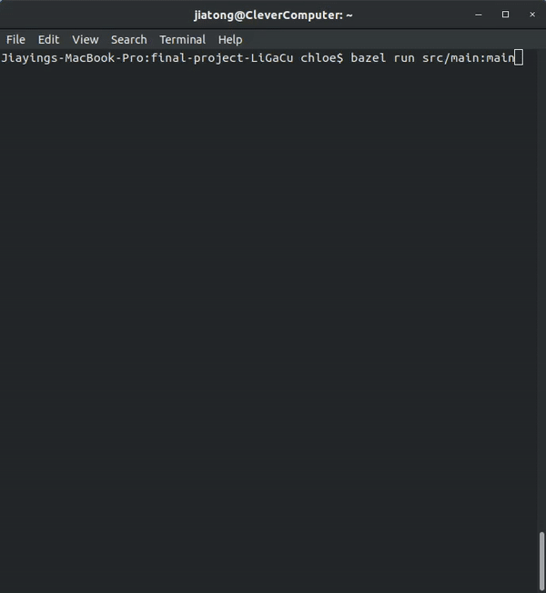</p>

---

## The data Structure

Each point on the map is represented by the class **Node** shown below and defined in [trojanmap.h](src/lib/trojanmap.h).

```cpp
class Node {
  public:
    std::string id;    // A unique id assign to each point
    double lat;        // Latitude
    double lon;        // Longitude
    std::string name;  // Name of the location. E.g. "Bank of America".
    std::vector<std::string>
        neighbors;  // List of the ids of all neighbor points.
};

```

---

## Prerequisites

### OpenCV Installation

For visualization, this project use OpenCV library.

Use the following commands to install OpenCV.

```shell
$ cd final-project-LiGaCu
$ git clone https://github.com/opencv/opencv.git
```

### Other library Installations

Please install Bazel before working on this project.

For Ubuntu:
```shell
$ sudo apt-get install cmake libgtk2.0-dev pkg-config
$ sudo apt install libcanberra-gtk-module libcanberra-gtk3-module
$ sudo apt-get install libncurses5-dev libncursesw5-dev
$ cp ubuntu/* ./
```

For MacOS:
```shell
$ brew install cmake
$ brew install ncurses
```

Next, type the following, but make sure that you set the **path_to_install_folder** to be the absolute path to the install folder under opencv. For example, if cloned this repo into "final-project-LiGaCu", **path_to_install_folder** should be "final-project-LiGaCu/opencv/install":

```shell
$ cd opencv/
$ mkdir build install
$ cd build
$ cmake -D CMAKE_INSTALL_PREFIX=**path_to_install_folder**\
 -D BUILD_LIST=core,highgui,imgcodecs,imgproc,videoio\
 -D WITH_TBB=ON -D WITH_OPENMP=ON -D WITH_IPP=ON\
 -D CMAKE_BUILD_TYPE=RELEASE -D BUILD_EXAMPLES=OFF\
 -D WITH_NVCUVID=ON\
 -D WITH_CUDA=ON\
 -D BUILD_DOCS=OFF\
 -D BUILD_PERF_TESTS=OFF\
 -D BUILD_TESTS=OFF\
 -D WITH_CSTRIPES=ON\
 -D WITH_OPENCL=ON ..
$ make install
```

---

## Run the program

Please run:

```shell
$ bazel run src/main:main
```

If everything is correct, this menu will show up.

```shell
Torjan Map
**************************************************************
* Select the function you want to execute.
* 1. Autocomplete
* 2. Find the position
* 3. CalculateShortestPath
* 4. Travelling salesman problem
* 5. Cycle Detection
* 6. Topological Sort
* 7. Exit
**************************************************************
Please select 1 - 7:
```

## Test the program

trojanmap_test.cc is for you to test the fuctionality of algorithms in this project (you can add more   ), please run
```shell
$ bazel test tests:trojanmap_test
```

# Demonstrations

## Feature 1: Autocomplete the location name

### Description

We consider the names of nodes as the locations. User types in the partial name of the location and the program shows a list of possible locations with partial name as prefix on the terminal. This function treat uppercase and lower case as the same character.

Example:

Input: "ch" \
Output: ["ChickfilA", "Chipotle Mexican Grill"]

Input: "ta" \
Output: ["Target", "Tap Two Blue"]

<p align="center">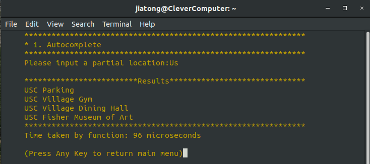</p>

### Time Complexity

The amortized time complexity of this function is O(n), where n is the total number of nodes with a name. The first time user use this function, it will take O(n*) to initialize the hashmap, where n* is the total number of nodes in the map.

### Time spend in experiment

On a 2015 Dell laptop with i7-5700U, it takes 96 microseconds to search for "Us".

## Feature 2: Find the place's Coordinates in the Mape

### Description

User types in the a location's fullname, the program returns the latitude and longitude on the terminal and mark the given locations on the popup map window. There are no duplicated location names stored in the map. If the location does not exist, it will shows no result match on the terminal.

<p align="center">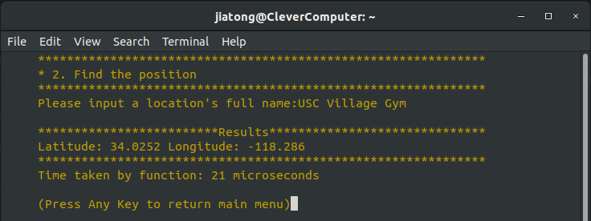</p>

<p align="center">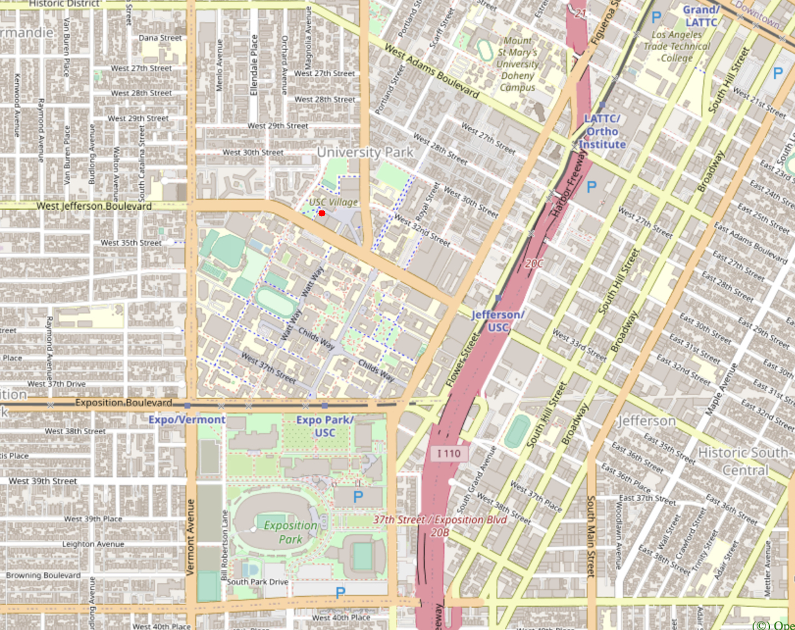</p>

### Time Complexity

The amortized time complexity of this function is O(1). The first time user use this function, it will take O(n*) to initialize the hashmap, where n* is the total number of nodes in the map.

### Time spend in experiment

On a 2015 Dell laptop with i7-5700U, it takes 21 microseconds to search for "USC Village Gym".

## Feature 3: CalculateShortestPath between two places

### Description

User types in two locations A and B, the program returns the best route from A to B on the terminal and shows the path on the popup map window. The distance between 2 points is the euclidean distance using latitude and longitude. User can choose to use Dijkstra algorithm or Bellman-Ford algorithm. If there is no path, please return empty vector.

<p align="center">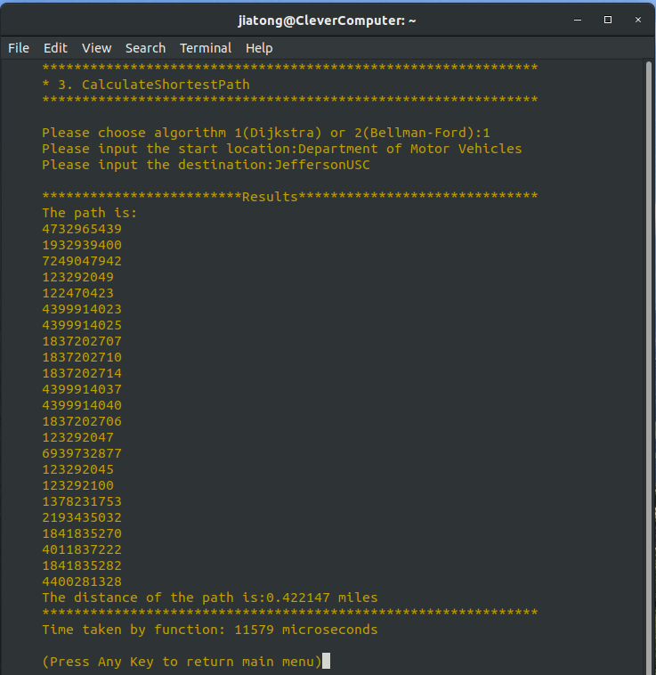</p>

<p align="center">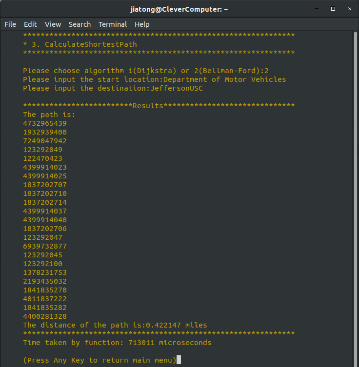</p>

The path calculated by Dijkstra:
<p align="center">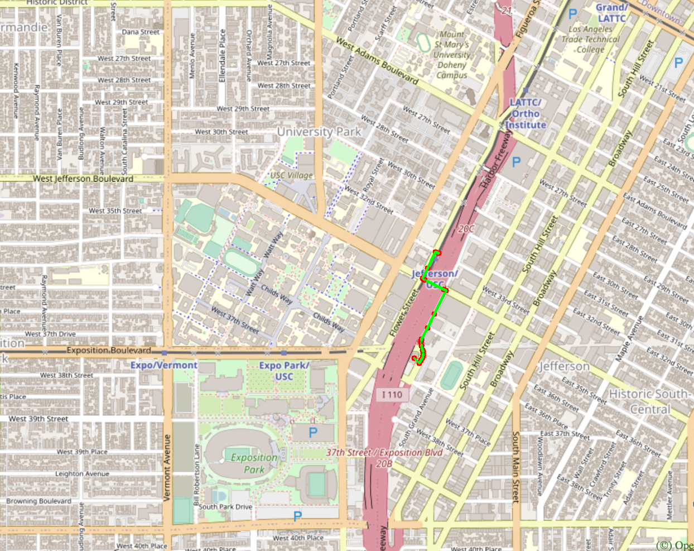</p>
The path calculated by Bellman-Ford:
<p align="center"></p>

### Time Complexity

- For Dijkstra: The function use minheap to implement Dijkstra algorithm. The time complexity of this function is O(mlogn), where m is the total number of edges in the map and n is the total number of nodes.
- For Bellman-Ford: The time complexity of this function is O(mn), where m is the total number of edges in the map and n is the total number of nodes.

### Time spend in experiment

On a 2015 Dell laptop with i7-5700U:

- Dijkstra takes 11579 microseconds to search for path from "Department of Motor Vehicles" to "JeffersonUSC".
- Bellman-Ford takes 713011 microseconds to search for path from "Department of Motor Vehicles" to "JeffersonUSC".

## Feature 4: The Travelling Trojan Problem (AKA Traveling Salesman!)

### Description

We assume that a complete graph is given to you for this part. That means each node is a neighbor of all other nodes.
Given a vector of location ids, assume every location can reach all other locations in the vector (i.e. assume that the vector of location ids is a complete graph).
User type the number of nodes N to randomly generate to build the fully connected map. This function find the shortest route that covers all the locations exactly once and goes back to the start point. The program will show the routes on the popup map. 

User can choose to use the following algorithms:

- Brute Force Method
- 2-Opt
- 3-Opt

<p align="center">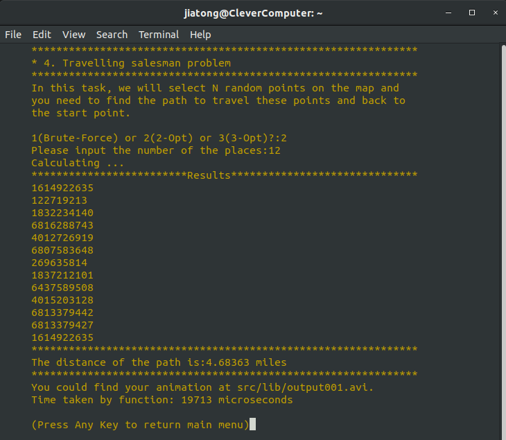</p>

For each intermediate solution, it will create a new plot and shows that as a animation and save it in src/lib/output001.avi.

<p align="center">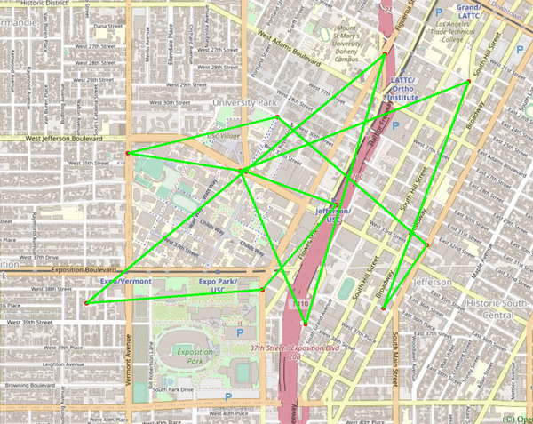</p>

### Algorithms Comparation

On a 2015 Dell laptop with i7-5700U:

- Brute-Force takes 8542497 microseconds to search for a path of 4.58363 miles length connecting random chosen 12 nodes.
<p align="center">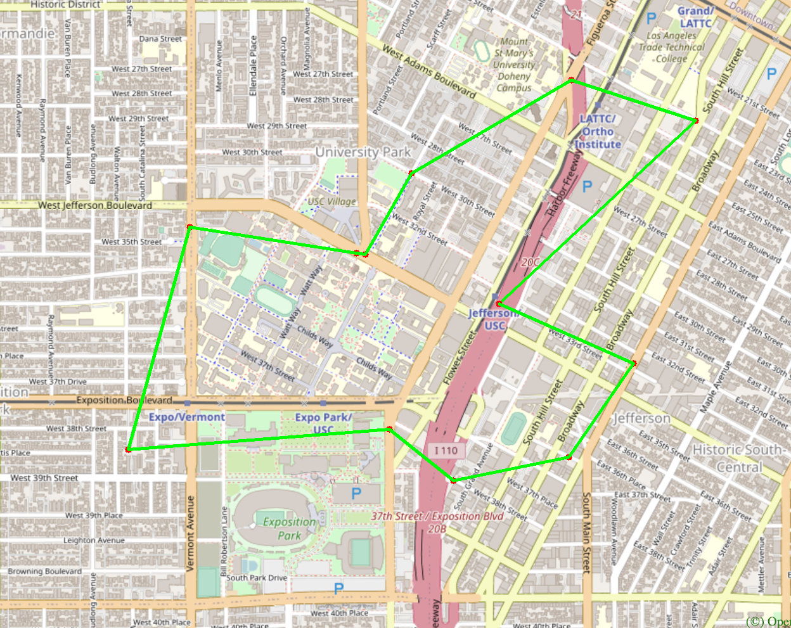</p>
- 2-Opt method takes 19713 microseconds to search for a path of 4.68363 miles length connecting the same 12 nodes as above.
<p align="center">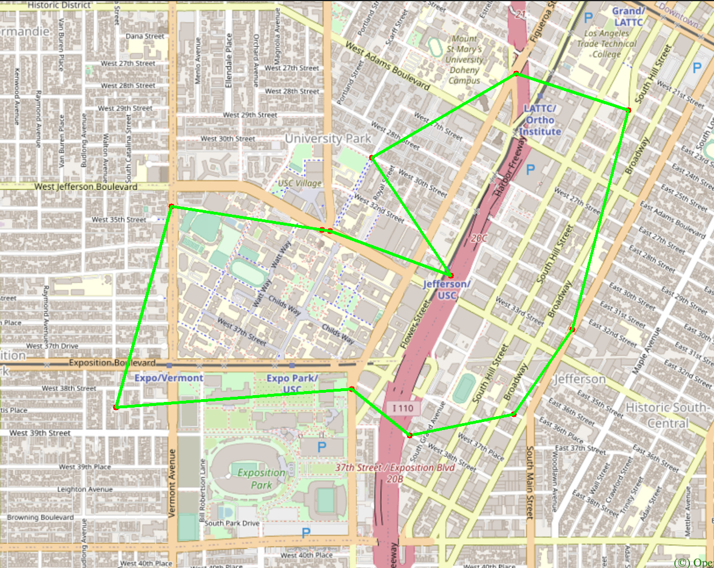</p>
- 3-Opt method takes 31974 microseconds to search for a path of 4.95979 miles length connecting the same 12 nodes as above.
<p align="center">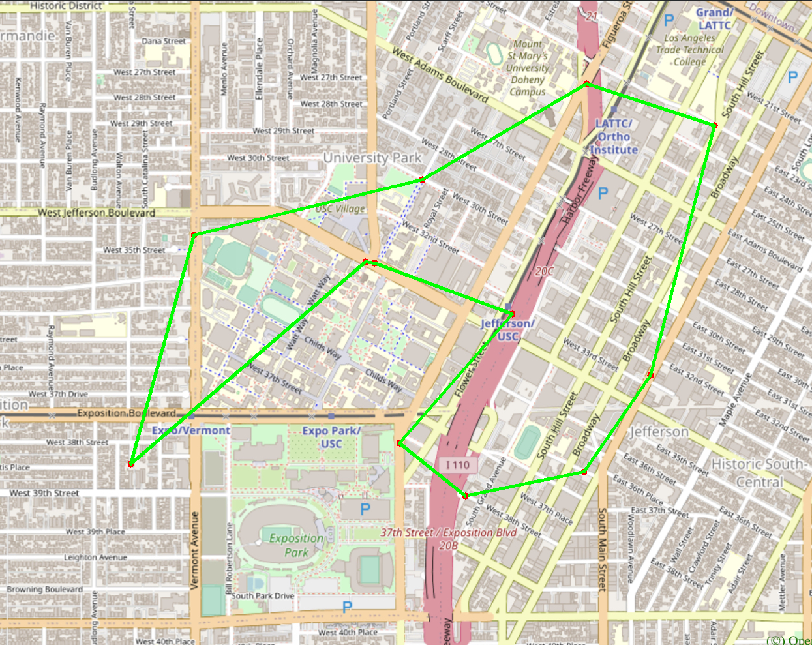</p>

## Feature 5: Cycle Detection

### Description

User types in four geographical parameters to form a square-shaped region in the map, then the program detect if there is a cycle in the given region or not and shows the result in the terminal. 

<p align="center">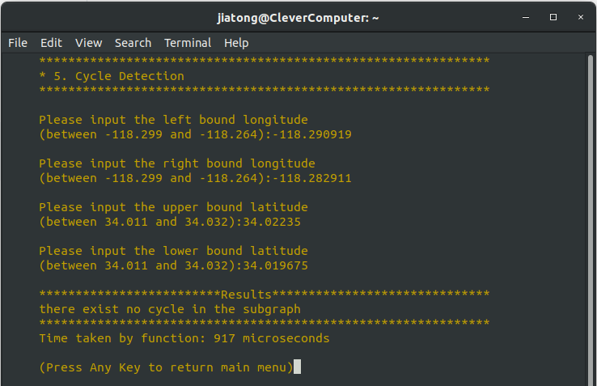</p>

<p align="center">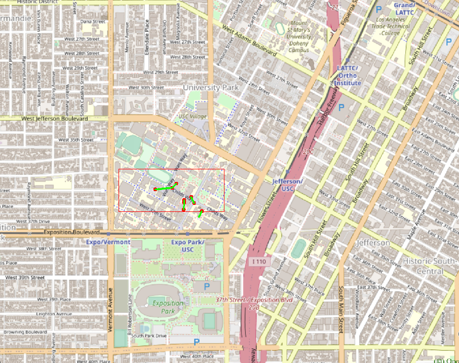</p>

### Time Complexity

The time complexity of this function is O(m+n), where m is the total number of edges in the given region and n is the total number of nodes in the map.

### Time spend in experiment

On a 2015 Dell laptop with i7-5700U:

The function takes 917 microseconds to search for the region {-118.290919, -118.282911, 34.02235, 34.019675}.

## Feature 6: Topological Sort

### Description

Tommy Trojan got a part-time job from TrojanEats, for which he needs to pick up and deliver food from local restaurants to various location near the campus. Tommy needs to visit a few different location near the campus with certain order, since there are some constraints. For example, he must first get the food from the restaurant before arriving at the delivery point. 

The TrojanEats app will have some instructions about these constraints. So, Tommy asks you to help him figure out the feasible route!

User can specify a file containing location names that Tommy needs to visit, and also a file containing some dependencies between those locations.

For example, in the input files:

<p align="center">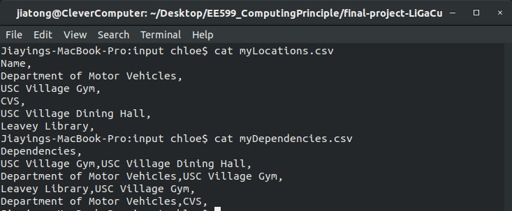</p>

And the program output:

<p align="center">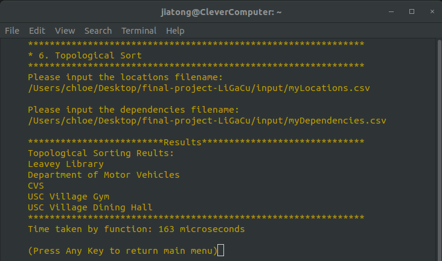</p>

This program can visualize the results on the map. It will plot each location name and also some arrowed lines to demonstrate a feasible route.

<p align="center">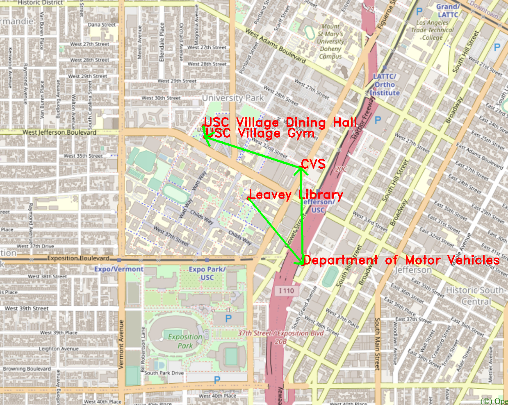</p>

### Time Complexity

The time complexity of this function is O(m+n), where m is the total number of edges in the given files and n is the total number of nodes in the given files.

### Time spend in experiment

On a 2015 Dell laptop with i7-5700U:

The function takes 163 microseconds to search for the input files as shown above.

# Some notes

I have a deeper understanding about concepts in C++, like reference, pointer, class constructor through this EE599 Computing Principle Course.

I also learned the tools like bazel and Google to do unit tests to make our big project developing and debugging easier.

Thank you TAs and Professor!